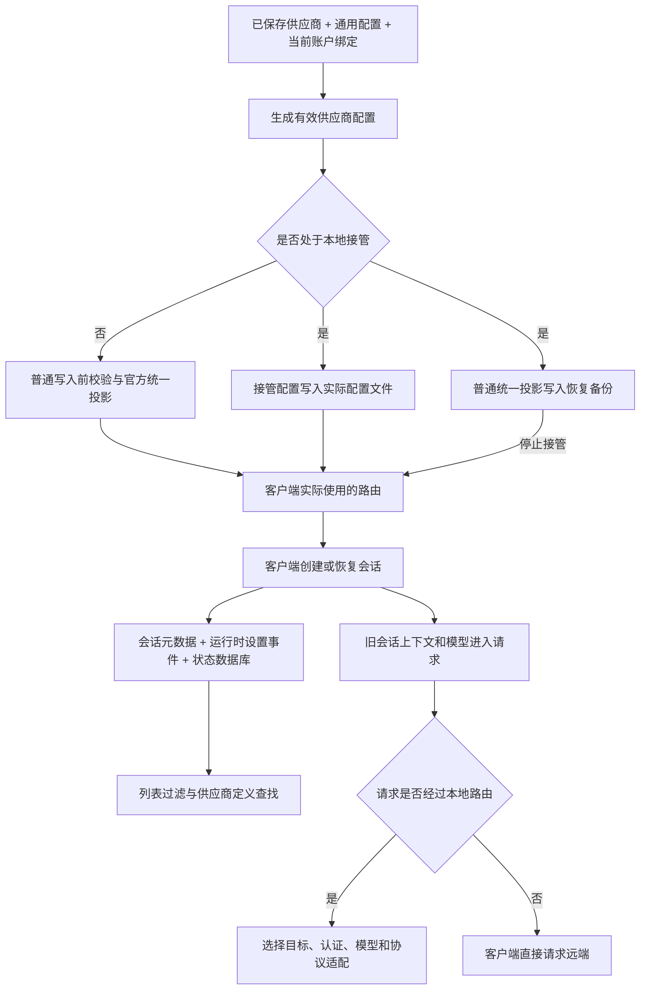

# Codex（编程助手）统一会话历史：定位、测试与技术分析

日期：2026-09-28。本轮仅调查、建立合成测试和设计方案，没有修改产品代码，没有读写用户的真实认证文件、会话或状态数据库，没有发布评论或提交合并请求。

**结论：这不是一个注入条件造成的单一故障。** 当前实现混合了“供应商选择”“历史分桶”“接管所有权”三个概念，同时历史迁移没有覆盖持久化运行时供应商状态。即使这些都修好，跨后端请求中的私有状态仍有独立的兼容问题。应分成若干可单独验证的修复，而不是扩展一个共享归一化函数。

## 1. 版本与证据边界

本地原始工作区停在 `f8768c58`（6 月 26 日提交）。本次已拉取远端，在独立工作区完成调查，并将可实施文档整理到 `codex/codex-history-repair`（正式实现分支），使用：

- 仓库主分支：`1ee2fdc3a791f1e73476c631c7ab7ce8fac0638f`（9 月 26 日提交，调查时远端最新版本）。
- 上游源码对照：`openai/codex`（官方编程助手仓库）的 `b412ff32c417f855c2b2d1581b77058eed87c84b`（0.156.1 版本）和 `1cc7e2361237ce7244430ee1d581c77f95c57ac8`（9 月 28 日主分支快照）。不同客户端版本的恢复细节不可混为一谈。
- #7386 的差异测试固定在 `664dc222c3c99d9a50dc781707c971ed09ecf35e`（该合并请求调查时的提交）。

证据分四级：**本机测试确认**、**源码确认**、**报告者实机观察**、**仍待验证**。文中不把第三方自述的测试当成本次测试，也不把合成测试当成桌面端完整复现。

测试材料保存在 `D:\cc-switch\.tmp-cluster\codex-history-20260928`（调查证据目录）。其中有议题与评论快照、相关合并请求及补丁、上游文件、固定源码归档、测试生成器、测试夹具和日志。

## 2. 交接报告必须先纠正的地方

| 交接判断 | 本轮核实结果 | 对方案的影响 |
| --- | --- | --- |
| 注入切片无人认领 | #7386 已明确关联 #6340；#7154、#5735 已处理官方接管；#6633 已处理运行时历史状态 | 优先补测试、评审和拆分现有工作，不能按空白区域新开重复方案 |
| #5815 只是议题，没有开放合并请求 | **#5815 就是开放合并请求**，26 个文件，新增 4800 行、删除 1729 行；维护者曾触发审查 | 可借鉴行为约束，但不应照搬其体量；议题接口也会返回合并请求，必须检查对象类型 |
| 官方内置预设正常就自带显式官方标识 | 当前前端官方预设的配置是空字符串 | #6340 的输入是合理的用户配置，但不能外推为全部官方用户必现 |
| 跳过迁移完全没有日志 | 启动和设置保存入口均记录调试日志；默认日志级别是信息级别 | 正确结论是默认不易见、设置页没有执行状态；注入早退本身确实无日志 |
| 两个拒绝条件与两个门槛组合成四种失效 | 迁移只有一个共享桶检查；接管是另一条写配置路径，直接绕开普通注入 | 应画两条写入链，而不是用组合计数替代调用关系 |
| 第三方迁移白名单缺少官方标识是缺陷 | 官方迁移是独立且需用户勾选的流程，来源中明确含官方标识 | 不得把官方标识塞进自动第三方迁移白名单，否则绕过用户选择 |
| 保留官方认证就足以保证任意旧会话续聊 | 认证、供应商定义、模型选择、请求中的私有状态分别受约束 | 统一分桶不等于无损跨后端恢复 |

当前设置文案已经明确提示：跨供应商继续旧会话时，对方后端可能无法解密推理内容。因此 #7257 的通用兼容层还涉及新增能力与产品取舍，不能完全当成既有开关的承诺缺陷。

## 3. 全局数据流与可信来源



必须区分这些权威来源：

| 数据 | 应信任的来源 | 容易被误当成权威的东西 |
| --- | --- | --- |
| 供应商原始路由及显式配置形态 | 已保存供应商及其通用配置来源 | 已注入统一路由的实际配置快照 |
| 当前官方认证 | 当前有效登录或明确选择的托管账户 | 早先备份中的冻结令牌 |
| 当前请求目标 | 已选供应商及该次请求冻结的路由上下文 | 历史桶名称、旧模型名称 |
| 历史原始归属 | 迁移前备份和逐会话账本 | 已经混合的共享桶 |
| 客户端列表可见性 | 该客户端真正使用的目录、数据库及过滤参数 | 一个“迁移完成”布尔值 |
| 后端私有状态是否可复用 | 生成该状态的后端与账户范围、协议约束 | 标识符前缀或共享桶名称 |

`model_provider`（供应商路由标识）既被客户端用于供应商查找，也被用于历史过滤，但它不是账户身份。`cc-switch-official`（官方接管标识）在当前应用内还兼任接管所有权信号。这是后续简单改名容易破坏清理逻辑的原因。

## 4. 根因一：普通官方配置的注入拒绝与不完整逆操作

### 4.1 已确认的 #6340 链路

有效官方配置进入写入规划，在统一开关开启时调用注入函数。当前关键判断原文是：

```rust
if doc.get("model_provider").is_some() {
    return Ok(config_text.to_string());
}
```

它判断的是键存在，不判断值是否为内置官方标识。因此显式 `model_provider = "openai"`（使用内置官方路由）会被原样写回。随后迁移要求实际配置路由到 `custom`（共享历史桶）；检查失败，返回 `live_not_unified`（实际配置尚未统一），不写完成标记。

这一拒绝对任意第三方手工路由是保护，对内置官方标识则过宽。本机合成测试确认了完整的“配置拒绝 → 迁移跳过 → 无完成标记”链。

**现有测试不能证明显式官方标识必须拒绝。** 名为“保留显式路由”的测试实际使用的是 `openai_https`（用户自定义路由名），不是 `openai`（内置官方标识）。可在不改变第三方保护不变量的前提下细分它们。

### 4.2 比交接报告更危险的形态漏洞

当前冲突检查只认识普通表，不认识 TOML（配置格式）的内联表。本机测试输入：

```toml
model_providers = { custom = { name = "Mine", base_url = "https://relay.invalid" } }
```

没有显式选择器时，注入会新增共享桶选择器，同时激活这张本应被拒绝的第三方表。若内联映射为空，则会新增选择器却没有创建对应定义。

这说明“遇到冲突宁可不统一”的不变量在当前实现中并未完整成立。修复显式官方标识前，应先把普通表、内联表及非法形态都纳入同一只读校验，再一次性构造结果，防止先改选择器再发现无法插表。

### 4.3 逆操作的关键不是删键，而是知道来源

当前逆操作只凭四个字段的表形状推测“这是应用注入的”。测试证实：用户自己写的同形共享表，即使注入函数没有改动它，也可能被逆操作移除；原先存在但未激活的同形表也会在往返后消失。

#7386 放行了显式官方标识，但其逆操作仍删除选择器。本次针对该请求固定提交的失败测试得到：**期望还原为显式官方标识，实际没有该键。** 这正是交接报告要求保留的边界，现有补丁尚未锁住。

建议在官方快照回填这一不可信入口，以已保存的原始配置为依据，仅撤销本次投影实际拥有的字段。不要凭表形状修改所有供应商，也不要把投影结果先写入数据库，再企图从中猜出原始路由。

还要区分 `openai_base_url`（内置官方路由的地址覆盖）、选中的配置档及命令行覆盖。只看到顶层官方标识，不代表使用默认官方地址。上游内置路由会单独消费该地址覆盖；换成自定义标识可能改变其语义。

## 5. 根因二：官方接管另写一个桶，且桶名兼任所有权

当前官方接管写入函数固定输出官方接管标识。它保留原生官方认证，将地址指向本机路由，并关闭 WebSocket（双向长连接），因为本地服务使用 HTTP/SSE（请求与事件流）。普通官方统一投影则使用共享桶、没有本机地址且启用双向长连接。

**两张表可以共用同一个桶名，同时具有不同地址与传输能力。** 接管场景无需等待双向长连接支持，才能统一分桶。真正难点是把“这是应用拥有的接管配置”从桶名中分离出来。

本机测试确认：

1. 普通统一投影选择共享桶，随后官方接管又选择官方接管桶。
2. 只把选择器改成共享桶，现有官方接管检测就返回假。
3. 先生成普通统一配置再应用接管，会留下一个不走本机代理的共享桶定义。仅保留别名而不随模式同步端点，旧会话仍可能绕开本地路由。

设置变更还有第二条链：重新应用官方配置时，接管状态会先更新恢复侧配置；在代理运行且 Codex 已接管的路径，现有实现随后还会调用活动配置同步函数，更新正在使用的配置。因此不能把该路径概括为“只改备份”。真正需要修复和验证的是：统一开关变化后，恢复侧与活动侧是否都采用同一共享桶语义，接管所有权识别是否仍可靠，以及任一同步失败时是否正确传播错误而不报告成功。

因此正确补丁至少覆盖：启动接管、接管中切换官方/第三方、接管中开关统一历史、停止接管、无备份异常恢复。不能仅改注入函数或放宽迁移门槛。

## 6. 根因三：列表可见之后，供应商定义仍可能缺失

供应商切换按选中卡片重新生成实际配置。历史会话中引用的旧标识未必还存在于新配置中；客户端加载供应商时查不到定义，会在发出网络请求前失败。#5974 的 9 月 23 日评论明确报告了这一阶段的错误。

上游 0.156.1 与本次主分支的列表逻辑还显示：未提供供应商过滤参数时，默认按当前供应商过滤；显式传空列表则可不限制供应商。因此“加回一个别名”有时能恢复打开，却**不能普遍保证所有客户端默认列表统一**。

别名策略必须明确业务含义：

- “保留原供应商定义”表示旧会话仍可能继续访问原后端。
- “别名随当前供应商一起投影”才表示旧标识继续使用当前选中的后端。

这两件事不能都叫“修复历史”。#7386 补写的官方接管别名永远指向官方认证形态；本机测试确认第三方成为当前目标时，该别名仍没有第三方或本机地址。它可能解决定义缺失，却不能证明旧会话跟随当前供应商。

对应用自己产生的旧官方标识，可通过明确的历史迁移修复引用，或提供随当前模式同步的兼容别名；对用户自定义的其他标识，应保持既有路由语义，不宜擅自重定向。

## 7. 根因四：迁移只更新了部分持久化状态

### 7.1 元数据、运行时事件和数据库需要一起看

当前逐行迁移只接受 `session_meta`（会话元数据事件），修改其中的供应商标识。它跳过 `thread_settings_applied`（已应用运行时设置事件）中的 `thread_settings.model_provider_id`（该次运行时设置的供应商标识）。

合成会话测试结果：会话元数据与 SQLite（状态数据库）都迁入共享桶，运行时事件仍保留原官方标识，消息和推理内容保持原样。

上游状态提取器的关键原文是：

```rust
EventMsg::ThreadSettingsApplied(event) => {
    let settings = &event.thread_settings;
    metadata.model = Some(settings.model.clone());
    metadata.model_provider = settings.model_provider_id.clone();
    // 其余字段略
}
```

因此重新提取历史元数据时，旧运行时事件能够重新覆盖已迁移的桶。这是“标记完成但索引再次不一致”的一条真实机制。

**边界声明：** 本次没有运行真实桌面会话的重建与恢复全过程。0.156.1 和当前主分支的“恢复持久设置”辅助函数只恢复部分设置，不能据此断言每个版本、每个恢复入口都直接用这一个事件恢复路由。已确认的是遗漏字段和上游索引覆盖逻辑；具体桌面症状仍须按客户端版本验证。

### 7.2 官方接管历史根本不在官方迁移来源集合中

当前官方迁移来源只有内置官方标识，不含应用生成的官方接管标识；第三方迁移也不负责它。测试中，只有官方接管历史的目录可以得到零项迁移结果并写入完成标记。

所以即使让今后的官方接管使用共享桶，既有接管历史也不会自动得到修复。需要独立的升级迁移及新版本完成标记，不能让旧的一次性标记永久挡住修复。

### 7.3 完成标记是过去一次执行的记录，不是磁盘持续一致的证明

当前完成标记只核对规范化后的配置目录。测试确认：一次空迁移完成后，在同一目录新增原官方桶会话，下一次会返回 `already_migrated`（已经迁移），不会扫描该会话。

这不等于“标记总在写数据之前生成”。正常成功路径恰好是在文件与数据库操作之后写标记；数据库失败测试也确认不写标记。更准确的问题是：

- 活动客户端、其他配置档或外部写入仍可能产生旧桶会话。
- 旧版迁移没有处理运行时字段和官方接管桶。
- 损坏的元数据行、读不到的目录、缺少预期表结构等可能被跳过，计数为零却不代表完成了有效检查。
- 客户端重建索引可能重新导入旧运行时供应商值。

#4710 的原始机器属于哪一种，本轮无法仅凭议题记录唯一确定。

### 7.4 数据库发现不能用“全盘找所有数据库”代替

当前统一位置解析器包含配置目录默认数据库，以及配置指定或环境变量指定的位置；配置优先于环境变量。这已比交接早期讨论完善。

但不自动包含配置目录下的 `sqlite`（常见子目录）位置，除非明确配置；测试对“未配置遗漏、配置后迁移”均已确认。环境变量还属于应用进程自己的环境，不一定等于另一个启动方式下的客户端环境。

这证明候选发现存在边界，不证明该子目录一定是每个桌面版本的权威数据库。方案应增加只读诊断、显示候选来源，核对客户端实际位置后再迁移；不能遍历所有版本数据库并统一改写。

### 7.5 失败恢复与并发仍有未闭合边界

测试复现了：先改会话文件，再遇到损坏数据库时退出，会话文件已经改变、数据库未改变、完成标记不存在。重试具备一定幂等性，但这不是跨文件事务。

备份目录身份文件在迁移后段才写入；没有身份文件的备份代际会被当作旧格式宽容接受。本机测试确认“缺少身份文件时接受其他目录”。不能直接把旧兼容规则改成全部拒绝，但新迁移必须在首个变更前写明来源、目标和状态，区分旧格式与新流程中断。

逐文件修改前后的两次时间与长度检查能够发现部分并发修改，但最后一次检查到替换之间仍有窗口；应用内部互斥锁也无法阻止外部客户端写入。现行迁移未恢复文件修改时间。后者会影响依赖文件时间的排序或扫描，需要独立边界测试。

## 8. 根因五：跨后端私有状态和旧模型是请求层问题

原生 Responses（响应接口）路径的通用模型映射读取的是另一类应用使用的环境映射，不会自动把供应商 TOML（配置文本）里的模型替换到每一个旧请求。聊天接口和另一种协议转换路径已有专门的模型选择逻辑，且会保留用户选中的合法目录模型。

本机测试确认：原生路径所用的通用模型映射不会改变旧模型；最终通用请求过滤也不会移除旧响应游标、项目标识或加密推理。该过滤只处理内部私有参数，不能充当跨供应商兼容器。

必须分别处理：

| 字段或状态 | 跨后端风险 | 合理边界 |
| --- | --- | --- |
| `input[].id`（输入项标识） | 格式约束、服务端归属、无存储引用 | 只处理已知类型中可省略的项标识，不递归删除所有同名字段 |
| `previous_response_id`（前次响应游标） | 指向另一后端的服务端状态 | 只有已有完整可重放上下文时才能清理；增量输入不得直接丢游标 |
| `encrypted_content`（加密推理内容） | 生成后端或账户无法验证 | 不承诺无损；来源明确或已知目标不兼容时按显式策略处理 |
| `item_reference`（服务端项目引用） | 本地没有被引用正文 | 不能假装省略后仍有完整上下文；无法展开应说明不支持 |
| `call_id`（工具调用关联标识） | 调用与结果配对依赖它 | 不得与输入项标识一起删除 |
| 旧模型 | 目标账户不支持、客户端恢复旧选择 | 保留目标目录内合法选择，仅替换已确认不适用的遗留值 |
| 压缩后的不透明状态 | 可能没有可恢复的完整可见历史 | 不应当作普通推理项直接删除 |

#7342 已有很窄的官方请求兼容补丁：针对直接推理项中数组形态的内容，同时清理相伴密文。其作者声明了真实请求对照，也明确未验证真实旧会话继续。可作为一个具体症状的切片，不能扩张为整个 #7257 已解决。

桶名不能判断密文来源。两个官方账户也可能构成不同验证范围；同一共享桶内可混入多个第三方。因此“开统一历史就对所有请求删密文”并不保守。

**本地路由关闭时，请求不经过本应用，任何代理兼容器都无效。** 必须在产品说明与验收矩阵中保留这一边界。

关于官方轻量响应协议限制：议题评论有失败观察，#5735 又有普通直连往返成功的自述；本次核实上游官方特性判断至少有按名称判断的路径，内置供应商也具有四字段投影未包含的其他默认能力。不能把问题简单断言为“只要桶名是共享桶就必定触发限制”，也不能宣称四字段投影完全等价于所有官方客户端版本。需要固定版本和目标模型的实机对照。

## 9. 本轮测试结果及局限

**最终结果：30 项对照与现状复现检查通过；4 项期望行为回归测试如预期失败。** 失败测试是本轮产物，不是已完成修复的失败构建。

测试器从固定版本提取了 53 个完整生产函数，记录函数摘要校验值，另包含原有模型映射实现。配置注入、逆操作、迁移主流程、逐行改写、真实数据库查询和更新均调用提取的原函数；没有重写这些业务算法来证明预设结论。

为隔离真实用户数据，设置存储、目录解析和最终文件写入使用测试替身，夹具均位于调查目录。SQLite（状态数据库）查询、备份和事务使用真实库。所有夹具保留，不自动删除。

| 覆盖组 | 已验证内容 |
| --- | --- |
| 普通注入 | 空官方配置对照、显式官方拒绝、第三方保护、普通与内联冲突、缺失定义、活动配置档边界 |
| 可逆性 | 用户同形表误清理、原有未激活表丢失、#7386 显式值丢失 |
| 官方接管 | 桶分裂、只改选择器破坏识别、保留别名的端点不一致 |
| 迁移 | 门槛、勾选选择、运行时字段遗漏、接管桶漏迁、一次性标记、位置发现、损坏行、数据库失败后的部分完成 |
| 保留约束 | 未知第三方历史、消息和密文不变、只恢复账本证明的会话 |
| 请求出口 | 旧模型及跨后端私有状态仍被保留，工具参数中的用户字段不误删 |

未完成的验证：完整仓库测试、全量静态检查、真实桌面生命周期、真实账户跨后端发送、操作系统原子替换和外部写入竞争。仓库指定 1.95 编译工具链在本机安装遇到跨盘重命名错误；诊断使用已安装的 1.96.0，配置解析器和数据库库固定为仓库所用的相同小版本。测试器其余依赖由独立锁文件固定，不冒充仓库原锁文件全量验证。

## 10. 对修复方向的判断

推荐顺序是：**先保护配置与逆操作边界，再统一接管写入，再补齐有版本的历史修复，最后处理目标明确的请求兼容。** 设置页状态可单独交付；它应消费后端真实执行结果，而不是依据开关推测完成。

### 10.1 独立源码复核补充

对相关调用链的独立复核没有发现推翻上述拆分的严重问题，但补上了三个实施前置条件：

1. 设置保存入口当前先写设置、再调用官方 Live（活动配置）重投影，并未天然取得供应商/接管路径使用的每应用切换锁。若直接在外层套锁，会与备份更新函数自身取锁形成嵌套风险；应在现有锁边界或已持锁内部辅助函数上协调，而不是重写切换主循环。
2. 接管状态下的重投影可能先成功更新恢复备份，再在活动配置同步时报错。仅回滚开关值不能恢复备份一致性；必须增加精确补偿或可诊断的未完成状态，并用故障注入测试覆盖这一顺序。
3. 迁移/还原互斥只覆盖历史操作，不能自动串行供应商切换或接管写入。后台迁移、设置重投影和切换之间需要明确协调；状态界面还需要一个可跨重启读取的持久状态来源，不能依赖日志或单个完成标记。

这些是对计划的收窄要求，不代表应引入新的通用事务框架。若现有内部辅助函数不能安全承载锁和补偿边界，应在预检阶段等待或跳过，并向用户报告原因。

以下捷径应排除：

1. 去掉迁移的实际路由门槛，或仅允许官方接管桶通过。迁到共享桶时活动路由仍用别的桶，会亲手制造不可见。
2. 把官方标识加入自动第三方迁移白名单。它破坏用户是否迁入官方历史的选择。
3. 每次切换改全部数据库行。它不能覆盖运行时事件，还会动用户未选择迁移的历史。
4. 为所有旧标识补一张相同的官方表。定义存在不等于使用正确的目标、账户和本地路由。
5. 全局删所有标识符、密文或旧模型。会破坏同后端状态和工具调用配对。
6. 引入跨配置、所有历史文件、所有数据库及认证文件的“大事务”。无法消除外部写入方，复杂度远超首个可审查切片。

详细实施拆分与验收矩阵见同目录 `2026-09-28-codex-history-repair-plan.md`（修复实施计划）。

## 11. 关键来源

- [#6340：显式官方路由注入被拒](https://github.com/farion1231/cc-switch/issues/6340)
- [#4710：完成标记与磁盘观察不一致](https://github.com/farion1231/cc-switch/issues/4710)
- [#5972：迁移门槛与分桶讨论](https://github.com/farion1231/cc-switch/issues/5972)
- [#5974：官方接管与恢复故障](https://github.com/farion1231/cc-switch/issues/5974)
- [#7257：跨供应商续聊与维护者同意小切片的评论](https://github.com/farion1231/cc-switch/issues/7257#issuecomment-5757354766)
- [当前注入与接管实现](https://github.com/farion1231/cc-switch/blob/1ee2fdc3a791f1e73476c631c7ab7ce8fac0638f/src-tauri/src/codex_config.rs#L3494)
- [当前迁移与门槛实现](https://github.com/farion1231/cc-switch/blob/1ee2fdc3a791f1e73476c631c7ab7ce8fac0638f/src-tauri/src/codex_history_migration.rs#L198)
- [0.156.1 的状态提取逻辑](https://github.com/openai/codex/blob/b412ff32c417f855c2b2d1581b77058eed87c84b/codex-rs/state/src/extract.rs#L130)
- [0.156.1 的历史列表过滤逻辑](https://github.com/openai/codex/blob/b412ff32c417f855c2b2d1581b77058eed87c84b/codex-rs/app-server/src/request_processors/thread_processor.rs#L5429)
- [官方供应商能力与内置定义](https://github.com/openai/codex/blob/1cc7e2361237ce7244430ee1d581c77f95c57ac8/codex-rs/model-provider-info/src/lib.rs#L513)

交接报告中 #4692、#6534、#7434 等案例作为用户给定的经验约束使用，本轮没有重新逐条审计其审查历史。
