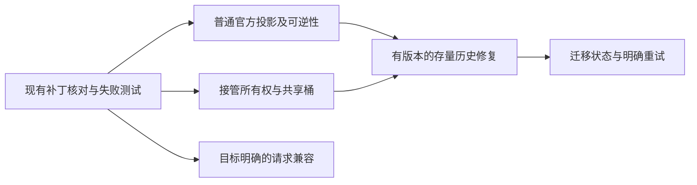

# Codex（编程助手）统一会话历史 Implementation Plan（实施计划）

> **For Claude（供后续执行者）：** 使用 executing-plans（按计划执行）技能逐项实施。**2026-09-28 晚间上游合入 Codex 写引擎重构（22 提交），切片一的载体被结构性取代，PR #7728 已关闭（superseded）**；逐项核查结论与切片路线 v2 见 §11，本文 §3-§9 中涉及的旧函数名（`inject_codex_unified_session_bucket`、`restore_live_settings_for_provider_backfill`、common-config 片段等）在 main 上已不存在，仅作历史设计依据保留。

**Goal（目标）：** 在不改变第三方手工路由、认证权威来源和官方历史迁移选择的前提下，修复统一历史的配置投影、接管分桶与历史状态一致性；跨后端请求兼容只作为后续可独立审查的能力，首个修复不扩大为通用重放承诺。

**Architecture（架构）：** 只在应用负责的写配置与回填入口生成、撤销路由投影。实际路由统一后再按账本修复已选择迁移的历史，并以明确的执行状态替代“开关开启即完成”的假象。请求层首个切片只处理经本地路由、目标与不兼容条件明确的出站副本。保留现有主循环、锁时机、回滚分支、协议转换和故障转移；新增逻辑放在已有扩展点的专用分支中。

**Tech Stack（技术栈）：** Rust（后端语言）、toml_edit（保留配置结构的解析库）、rusqlite（数据库访问库）、React/TypeScript（前端框架与语言）、Tauri（桌面应用框架）。优先使用已有依赖与切换锁。

---

## 1. 实施前提与已有工作

以调查主分支 `1ee2fdc3`（固定基线）为分析依据。实施前重新拉取远端并检查下表状态；下面是 2026-09-28 快照。

| 现有合并请求 | 当前内容与规模 | 本方案如何利用 |
| --- | --- | --- |
| [#7386](https://github.com/farion1231/cc-switch/pull/7386) | 显式官方注入、补写兄弟定义；1 文件，新增 289 行；非草稿 | 已针对关键函数测试。补显式值往返失败测试；要求区分别名目标与定义存在，不宜照单接受全部行为 |
| [#5735](https://github.com/farion1231/cc-switch/pull/5735) | 接管桶、切换串行化、认证保护；9 文件，新增 958 行 | 对照最新主分支已有认证保护，避免重复；优先协调接管切片 |
| [#7154](https://github.com/farion1231/cc-switch/pull/7154) | 接管、来源标记、第二版迁移、重试界面；14 文件，新增 891 行；草稿 | 行为约束较完整，但真实桌面恢复尚待作者验证；可按新路由、存量修复、状态界面拆开评审 |
| [#6633](https://github.com/farion1231/cc-switch/pull/6633) | 历史运行时供应商一致性及接管兼容 | 运行时字段修复已有实现方向；迁移补丁可与接管方案分离 |
| [#7342](https://github.com/farion1231/cc-switch/pull/7342) | 官方请求中一种推理重放污染；1 文件，新增 220 行 | 请求兼容的最小切片参考，不宣称覆盖所有跨后端状态 |
| [#7487](https://github.com/farion1231/cc-switch/pull/7487) | 保留经验证的非活动供应商定义；3 文件，新增 351 行 | 与“旧会话继续使用原后端”语义有关；不能替代统一桶 |
| [#7469](https://github.com/farion1231/cc-switch/pull/7469) | 切换后批量更新数据库供应商与模型；2 文件，新增 210 行 | 不建议作为本问题簇的基础：覆盖面大、没有同步运行时事件，且绕开迁移选择 |
| [#7073](https://github.com/farion1231/cc-switch/pull/7073) | 让官方桶名可配置；18 文件，新增 1103 行 | 本次不需要增加可配置桶名；会扩大状态空间 |
| [#5815](https://github.com/farion1231/cc-switch/pull/5815) | 跨配置、认证、历史与数据库协调；26 文件，新增 4800 行 | 只借鉴不变量，不复制整体重构 |

除了 #7386 的定向函数审查与测试，其他条目主要核对说明、变更列表和相关片段，**不代表完成了整个合并请求的质量审查**。

本次没有发送认领消息。后续若要公开提交，应在用户授权对外沟通后，与现有作者及维护者确认重叠范围；根因发现应引用 #6340、#5974、#6633 等原始来源。当前检索未找到由 #7257 作者提交到本仓库的开放合并请求，不能据此推断其没有在开发。

## 2. 修复需要保持的硬约束

1. 任意第三方手工路由和未知供应商标识不被统一开关改写。
2. 当前有效官方登录是权威；只切换历史投影时不重新写入冻结认证。
3. 未勾选迁入官方历史，不修改既有官方历史。
4. 开关开启且活动配置受应用管理时，新建会话进入同一个共享桶；直连和接管只是该桶下端点与传输能力不同。
5. 投影可逆：原始“没有选择器”和“显式官方选择器”必须区分；用户原有的同形表必须保留。
6. 迁移后，被选择的会话段在元数据、持久化运行时供应商字段和权威数据库中保持一致；消息正文、工具内容、密文、会话编号不变。
7. 恢复仅作用于账本能够证明来源的会话；统一期间新产生的混合会话不猜归属。
8. 一次失败不能写完成标记；部分完成必须可诊断、可重试，不能被显示成全部成功。
9. 代理层不改变未选择兼容处理的同后端请求；官方认证失败继续遵守现有禁止向其他供应商自动重试的保护。

## 3. 推荐交付顺序



不要机械追求总计两三个文件。每个可独立交付的切片保持单一关切；接管和迁移涉及多入口，压成几行往往是在省略正确性条件。请求兼容不等待整个历史工程合并，但必须保持独立。

### 3.1 现有扩展点与禁止改动的主流程

- 普通统一使用现有 Codex 官方配置规划与注入入口；官方回填继续先剥离通用配置，再按现有供应商回填规则恢复。统一历史的来源判断只放在 Codex 官方专用边界，不重排共享回填次序。
- 接管复用现有每应用切换锁、备份更新、活动配置同步和恢复分支。只调整官方投影的桶、来源判断或必要参数；不重写 `hot_switch_provider`（供应商热切换）、锁的持有时机、跨应用回滚和认证轮换流程。
- 设置保存路径当前会先更新设置再调用官方重投影，不能假设它已经取得每应用切换锁。开关变更必须在现有锁边界内重新读取供应商和接管状态；应复用已持锁的内部辅助函数或调整锁边界，避免在外层加锁后再次调用会取同一把锁的函数。
- 历史迁移复用逐行改写入口和现有数据库定位逻辑。`rewrite_codex_session_file_lines`（会话文件逐行改写器）当前接收无状态 `Fn`（函数回调）；若要按会话段跟踪运行时字段，必须先用最小夹具证明需要扩大回调状态，不能把它描述成现成的有状态解析器。
- 请求兼容复用 `forwarder.rs`（转发器）中按目标供应商隔离的原生请求入口。共享过滤器、协议转换、故障转移、重试和同后端行为默认冻结，除非症状测试证明必须改动。

每个切片合并前至少通过两类门槛：目标路径的行为测试，以及未选择该功能的同后端/其他应用回归测试。任何无法证明来源、目标或回滚边界的实现，先停在诊断或跳过状态，不扩大写入范围。

## 4. 切片一：普通官方投影与来源明确的逆操作

主要修改后端配置模块和官方快照回填边界；测试以内联模块为主，必要时补切换集成测试。

### 4.1 先写边界测试

依次增加这些用例，每条先在主分支观察失败或既有保护成立：

| 输入或过程 | 预期 |
| --- | --- |
| 空官方配置，开关注入再还原 | 还原后选择器仍缺省 |
| 显式官方选择器，注入再还原 | 还原后仍显式为内置官方标识 |
| 显式第三方选择器 | 文本与有效路由不变 |
| 普通表或内联表中的第三方共享项 | 拒绝注入，不能激活第三方地址 |
| 空内联映射 | 生成完整合法配置，或明确不支持并不修改；不能留下悬空选择器 |
| 用户原有同形共享表 | 往返保留原表 |
| 投影后二次注入 | 幂等 |
| 用户修改了投影字段 | 不把用户修改静默当作应用字段删除 |
| 内置官方地址覆盖存在，选择器显式或缺省 | 保持原路由，报告不能统一的原因 |
| 活动配置档另有选择器 | 不宣称顶层投影代表实际已统一 |
| 通用配置提供选择器 | 回填保持供应商与通用配置原有归属，不把投影污染写入供应商 |
| 无效配置、字段类型错误 | 写入前失败，不改变当前供应商和实际配置 |

现有诊断中的四条失败测试可作为具体起点，但正式测试要接入真实入口，不保留调查用的依赖替身。

### 4.2 再实现最小纯规划

建议返回一个小型内部结果，而不是遇到任何拒绝都返回无法区分的原字符串。以下是设计形状，名称可按项目习惯调整：

```rust
// 内部结果；不新增通用插件式策略框架。
enum OfficialProjectionStatus {
    Applied,
    AlreadyUnified,
    Skipped(OfficialProjectionSkip),
}

enum OfficialProjectionSkip {
    ExplicitThirdPartyRoute,
    ConflictingSharedDefinition,
    BuiltinEndpointOverride,
    UnsupportedProviderShape,
    ProfileRouteOverride,
}
```

规划顺序固定为：解析 → 判断有效路由与可管理范围 → 检查普通/内联表的冲突 → 在内存中构造完整合法结果 → 验证 → 写出。不要在检查完所有拒绝条件前改选择器。

仅放行缺省或显式内置官方路由；对有自定义端点、未知结构等无法证明保持语义的配置，返回具体跳过原因。保持第三方入口的现有行为。

### 4.3 用可信原始配置恢复字段来源

推荐在官方回填入口传入**投影前的有效供应商配置**，重建预期投影，只撤销与预期投影相同且由该投影引入的字段，再按既有规则移除通用配置。这里的“可信原始配置”仍需先证明取得路径、覆盖优先级和配置档边界；如果只能从已投影的活动文件反推，就必须跳过并报告冲突，不能把建议当成已有实现能力。

这一顺序需要在官方专用边界实现，不能改变其他应用的共享剥离算法。原始字段从有效供应商与通用配置组合得到；不从已投影的实际配置猜测。

逆操作规则：

- 原始选择器缺省，才删除生成的选择器。
- 原始显式为官方，恢复原值及原始配置项结构。
- 共享定义由投影新增，才移除；原本存在则保留或恢复原项。
- 实际字段与预期投影不一致，保留用户修改并报告冲突，不进行猜测性回填。
- 重新启动后仍可从未污染的已保存配置重建来源；不能只依赖进程内标记。

若已有接管工作采用持久化来源注释，可评估复用，但注释只是来源证据之一：必须结合供应商、配置指纹和严格端点检查。不要仅为恢复一个键引入新的数据库结构。

### 4.4 验证与交付

运行后端配置测试和供应商切换测试，再跑后端格式、静态检查与相关集成测试。确认原始供应商记录、官方登录、通用配置都没有被投影污染。该切片只关联普通注入与逆操作，不关闭接管及请求兼容议题。

### 4.5 实施记录（2026-09-28，切片一已落地）

改动文件：`src-tauri/src/codex_config.rs`、`src-tauri/src/services/provider/live.rs`、`src-tauri/src/codex_history_migration.rs`（+三份统一历史指南 zh/en/ja 的注入拒绝条件说明）。

已成立的规则（与 §2 硬约束一一对应）：

1. 仅放行缺省或显式内置官方 `openai` 的选择器；带顶层 `openai_base_url` 的旧式官方中转无论选择器显式或缺省一律跳过（§4.1 第 9 行），第三方显式路由保持原样。
2. 冲突检查覆盖普通表、内联表与非表形态：`model_providers` 非表、`custom` 非表均视为冲突跳过；空内联映射会生成完整合法配置（选择器与桶条目同时出现）。
3. 逆操作（`strip_codex_unified_session_bucket_with_original`）以**存储的原始供应商配置**为还原依据，采用**字段级来源回退**而非整文本比对：只撤销注入真正引入的选择器（缺省→删除、显式官方→恢复 `openai`）与原始没有 `custom` 时才引入的桶条目；写入期规范化产物、`model_catalog_json` 指针、用户手改一律保留。归属判断与注入准入条件逐条镜像，无法证明归属时保持原样并告警。

> 关键决策记录：最初实现用"重建预期投影→整文本精确比对"决定是否还原。审查发现这会因写入路径在注入前做的合法增量（保留表迁移、无名 custom 表补 name、模型目录指针）必然失配——失配后整份投影被留在存储配置里，正是本切片要消灭的污染形态；且用户改了任何其他字段时桶也无法剥离。字段级回退是 §4.3"只撤销与预期投影相同且由该投影引入的字段"的直接实现。回填入口顺序保持不变：先剥通用配置片段与 `[mcp_servers]`，再撤销投影。

未做（后续切片范围）：接管共享桶协调（§5）、存量历史第二版迁移（§6）、状态界面（§7）、请求兼容（§8）；设置页文案与 UI 属切片四。验证细节见对应 PR 描述。

## 5. 切片二：官方接管使用共享桶，所有权单独判断

主要修改后端配置模块、路由服务与官方重新应用入口。优先与 #5735 或 #7154 对齐，不另外发明第二套接管状态，也不新增一套接管事务写入流程。

### 5.1 建立状态矩阵

| 统一开关 | 当前目标 | 本地接管 | 活动桶 | 认证与端点 |
| --- | --- | --- | --- | --- |
| 关闭 | 官方 | 关闭 | 保持原生官方路由 | 当前官方登录，官方端点 |
| 开启 | 可管理的官方配置 | 关闭 | 共享桶 | 当前官方登录，官方直连能力 |
| 关闭 | 官方 | 开启 | 保持既有官方接管桶 | 当前官方登录，本机端点，事件流 |
| 开启 | 可管理的官方配置 | 开启 | 共享桶 | 当前官方登录，本机端点，事件流 |
| 任意 | 第三方 | 任意 | 原供应商明确选择的桶 | 遵守原供应商认证与路由规则 |

最后一行不能被偷换为“把任意第三方强制改成共享桶”；仅应用生成的第三方模板当前自然使用该桶。

### 5.2 所有权与写入顺序

源码核对显示，当前设置保存入口没有取得每应用切换锁，而接管备份更新辅助函数会自行取锁；实施时必须先确定唯一的锁边界，不能直接把两个现有入口嵌套调用。设置、供应商切换和接管切换必须在同一状态快照上作决定。

1. 沿用现有每应用切换锁，在同一入口重新确认当前供应商与接管状态。
2. 沿用现有官方接管投影、备份更新和恢复投影，计算共享桶下的目标地址与传输参数；不另建“接管事务”或整份配置回写流程。
3. 在已有写入前检查中补充共享表冲突和应用所有权判断；失败时保持现有活动配置不变。
4. 沿用现有活动配置同步分支和错误传播。代理运行且官方已接管时，必须验证活动配置是否同步到新的官方投影；不能把“更新备份”当作成功标准，也不能假设所有路径只改备份。
5. 明确处理“恢复备份已更新、活动配置同步失败”：优先用已有快照或内部回滚辅助恢复原备份；若无法安全补偿，必须保留可诊断的未完成状态并阻止后续误恢复，不能只回滚设置值后返回失败。
6. 只有现有恢复、备份和活动同步结果都一致后，才报告开关已应用；认证轮换仍由原流程负责。
7. 停止接管及无备份恢复继续走现有恢复分支，只在 Codex 官方专用路径识别应用拥有的共享桶投影；不把普通第三方共享表误判为官方接管。

历史模式变更只重写配置。账户切换仍走现有明确的账户切换流程，两者不能共享“整份认证回写”的捷径。

### 5.3 兼容别名处理

第一选择是修复已选择迁移的旧官方接管历史引用。如果提供过渡别名，必须说明它表示“跟随当前供应商”还是“保留原供应商”，并覆盖模式变化：

- 接管时不得绕过本机地址。
- 停止接管后不得遗留失效本机端口。
- 切到第三方时不得因补写官方表而悄悄走官方账户。
- 用户自己拥有的同名表不得覆盖。

不能仅用“表存在”作为通过标准。

### 5.4 必测边界

官方直连 → 接管 → 关闭接管；官方接管 ↔ 第三方接管；接管中开关统一；恢复备份已写入但活动同步失败；过期或缺失备份；同名用户表；供应商切换、接管切换与设置保存并发；模拟官方认证刷新后重投影。每次都断言实际桶、目标端点、恢复配置及认证未被回退。

## 6. 切片三：第二版存量修复，补齐运行时字段与来源账本

这是独立历史迁移，不是每次切换重写所有会话。依赖活动配置已经符合共享桶约束，且用户明确选择迁入既有官方历史。

### 6.1 来源与范围

- 来源包含内置官方标识与可确认由应用生成的旧官方接管标识。
- 不能靠第三方迁移白名单纳入官方历史。
- 旧第一版完成标记不能挡住第二版修复。是否增加版本字段、如何兼容现有 `codex_official_history_unify_v1`（官方历史统一第一版标记）以及如何重试，必须先按真实设置结构和旧状态读取代码验证，不能预设只给元数据文件加一个版本字段。
- 第一版已将元数据改成共享桶、但运行时字段仍为官方的会话，只有具备旧官方账本或明确来源证据时才修复。
- 混合文件按会话段处理；只改目标会话段中的运行时供应商字段，不把整份文件中的所有官方字符串替换掉。

### 6.2 先预检，再写入

一次执行的状态应明确为：

```text
待执行 → 预检 → 已建立备份与来源清单 → 改写中 → 校验中 → 完成
                   ↘ 等待客户端关闭 / 路由未统一 / 不支持的结构
                                      ↘ 部分完成、可重试
```

预检列出确切的会话文件、会话段和数据库行；验证结构，识别损坏记录，读取客户端目录与数据库位置。新代际在首个修改前写入来源目录、目标、版本和计划清单；备份所有将要修改的对象后再改数据。计划清单只服务于本次明确目标的迁移，不先设计覆盖所有历史和配置的通用重放账本。

现有迁移互斥只串行迁移与还原，不能自动阻止供应商切换或接管写入。迁移写文件和数据库前必须与 Codex 每应用切换锁建立明确的协调关系；若锁边界不能安全合并，就在预检阶段拒绝并显示等待，而不是让后台任务与配置写入并行。

不要声称一个应用内互斥锁能锁住客户端。优先要求客户端停止写入，在预检发现活动写入时延后并说明原因；它仍不是分布式锁，文档需要求迁移期间保持关闭。不得自动终止用户进程。

### 6.3 只改被证明需要改的状态

逐会话段执行（具体状态机须由最小夹具先证明）：

1. 改会话元数据供应商字段。
2. 改该段已应用运行时设置中的供应商字段。若复用现有逐行回调，需要先验证如何携带会话段状态；当前回调是无状态 `Fn`，不能仅凭增加一个结构体就承诺可行。
3. 按目标会话编号更新数据库；避免用无编号约束的大范围更新将新出现、未备份的行一起改掉。
4. 还原会话文件修改时间。
5. 核对三个位置一致，比较非路由正文的摘要校验值。
6. 在重新检查开关、目录及活动投影仍匹配后写入完成标记。

不修改模型字段来“顺便治好续聊”；旧模型需要独立策略，否则会改掉用户真实会话选择。

### 6.4 失败与恢复

不用建立覆盖全部配置、认证及会话文件的通用事务框架。只为这次有明确目标的迁移保留逐目标预检结果、原值与进度；先证明这些记录足以支持幂等重试，再记录已改目标。失败不写完成标记，停止后不会再后台修改用户状态。互斥锁只保护应用内调用，不能保证客户端外部写入安全。

“中途失败回滚”和“用户关闭统一后恢复官方历史”需区分：前者恢复精确原值；后者把账本证明的原官方历史恢复到当前可用的官方路由，不一定应重建已经淘汰的接管桶。具体恢复目标需在界面说明，账本保留原来源以便审计。

新格式缺失或损坏来源信息应显示不可安全自动恢复。已有旧格式的宽容读取需保留兼容分支并给出状态，不能无提示全盘接受或拒绝。

### 6.5 回归测试矩阵

元数据与运行时字段不一致；第一版标记已存在；只有官方接管历史；混合会话段；未知第三方；新建共享桶会话；归档历史；配置重定向数据库；不同目录的账本；无元数据旧代际；损坏新代际；数据库占用或损坏；第二个目标写失败；同秒重复执行；重复迁移和恢复；开关在执行中关闭；迁移与供应商/接管切换并发；目录变更；文件被外部追加；正文与修改时间保留。

前述并发保护应独立证明，不以“两个统计检查都通过”冒充外部写入安全。

## 7. 切片四：显示实际执行状态与重试

待迁移后端状态真实可读、能区分完成、部分完成、跳过和等待客户端关闭之后，再单独交付只读状态和明确重试入口；界面从后端结果显示，不直接读写完成标记，也不提前汇报未经证明的状态。状态必须有可在应用重启后读取的持久来源：可评估扩展现有 `local_migrations`（本机迁移状态）记录或建立本切片专用账本，但不能用日志或单个完成布尔值代替。

显示至少包括：实际活动路由是否统一、迁移是否被用户选择、执行版本与目录、迁移数量、尚未处理数量、跳过原因和最近错误。详细路径放在展开项中；常规提示用“当前配置指定了其他供应商”“请关闭客户端后重试”等可理解文案。

“已保存开关”“新会话路由已统一”“既有历史修复完成”是三个状态。不得用一个成功提示代表全部完成。

使用已有设置界面与接口组织方式，不增加一个通用迁移控制平台。界面文字需更新当前仓库的简体、繁体、英文和日文四份翻译。

测试开关成功但投影跳过、后台失败、部分完成、零数据、等待关闭、应用重启后状态恢复、重试成功以及过期前端缓存不能重放后端标记。重试命令必须复用迁移/还原互斥和配置切换协调，能识别已有运行任务或同一代际，避免重复后台改写。

## 8. 切片五：跨后端请求兼容，先做一个可证明的症状

### 8.1 首个切片

优先核对 #7342 的已有范围：官方原生响应请求、直接推理项具有已知不兼容的数组内容。保留其窄入口，不把它放进共享递归过滤器，也不影响其他协议转换。

增加以下负向用例：合法官方密文没有数组内容、正常消息中的同名字段、工具参数、压缩请求、其他供应商、聊天接口转换、同一请求的再次处理。验证输入顺序和工具调用关联标识不变。

### 8.2 通用兼容能力的后续研究

本轮不承诺通用跨后端重放。只有首个症状切片和真实请求对照证明了目标边界后，才另开研究或合并请求评估以下能力；不得把它们作为统一历史开关的隐含行为。

只有在可证明跨后端/跨账户，或用户明确选择一次兼容重放时，才处理供应商私有状态。无法判断来源时，不用桶名或标识符前缀猜测。

处理顺序：

1. 冻结本次目标供应商、账户范围与协议能力。
2. 根据已有完整上下文或显式来源证据判定是否可重放。
3. 解析已知输入项类型，保留消息与工具调用配对。
4. 对目标不接受的可省略项标识、游标和推理字段做最小处理。
5. 保留目标模型目录内的用户选择；仅在旧值不适用且目标有明确选择时使用目标模型。
6. 在请求副本上执行，持久化会话、认证和数据库不变。

仅有响应游标和增量工具结果时，不能删除游标后继续发送。引用无法展开、压缩上下文只有不透明数据时，应返回明确的“不具备可重放上下文”，不要静默截断。

失败重试要从未修改的原请求重新构造目标副本，不能将第一次清理后的对象继续传给其他目标。原生官方认证失败仍不得自动转发到其他供应商。

对于普通直连模式，服务端兼容器没有拦截入口；这不是配置补丁可以解决的。应明确兼容能力要求本地路由，或另行研究客户端支持的恢复覆盖参数。

## 9. 文件边界与验证命令

正式实现工作区根目录：

`C:\Users\jzcan\.codex\worktrees\codex-history-repair\cc-switch`（基于远端主线的独立实现工作区）。

| 所属切片 | 文件位置 |
| --- | --- |
| 官方投影、接管纯配置、内联测试 | `C:\Users\jzcan\.codex\worktrees\codex-history-repair\cc-switch\src-tauri\src\codex_config.rs` |
| 官方回填与有效配置边界 | `C:\Users\jzcan\.codex\worktrees\codex-history-repair\cc-switch\src-tauri\src\services\provider\live.rs` |
| 重新应用官方投影 | `C:\Users\jzcan\.codex\worktrees\codex-history-repair\cc-switch\src-tauri\src\services\provider\mod.rs` |
| 接管协调与恢复 | `C:\Users\jzcan\.codex\worktrees\codex-history-repair\cc-switch\src-tauri\src\services\proxy.rs` |
| 迁移与内联回归 | `C:\Users\jzcan\.codex\worktrees\codex-history-repair\cc-switch\src-tauri\src\codex_history_migration.rs` |
| 数据库位置统一解析 | `C:\Users\jzcan\.codex\worktrees\codex-history-repair\cc-switch\src-tauri\src\codex_state_db.rs` |
| 后端状态与命令 | `C:\Users\jzcan\.codex\worktrees\codex-history-repair\cc-switch\src-tauri\src\settings.rs`；`C:\Users\jzcan\.codex\worktrees\codex-history-repair\cc-switch\src-tauri\src\commands\settings.rs` |
| 设置界面 | `C:\Users\jzcan\.codex\worktrees\codex-history-repair\cc-switch\src\components\settings\CodexAuthSettings.tsx` |
| 请求接线及窄范围适配 | `C:\Users\jzcan\.codex\worktrees\codex-history-repair\cc-switch\src-tauri\src\proxy\forwarder.rs`；必要时在相邻供应商适配目录建立专用小模块 |

在工作区根目录运行针对性测试，按修改选择：

```powershell
cargo test --locked --manifest-path src-tauri/Cargo.toml --lib codex_config::tests
cargo test --locked --manifest-path src-tauri/Cargo.toml --lib codex_history_migration::tests
cargo test --locked --manifest-path src-tauri/Cargo.toml --lib services::proxy::tests
cargo test --locked --manifest-path src-tauri/Cargo.toml --lib services::provider::tests
```

这些命令依次验证配置、迁移、接管和切换。正式修改完成后再执行完整门槛：

```powershell
cargo fmt --manifest-path src-tauri/Cargo.toml --all -- --check
cargo clippy --manifest-path src-tauri/Cargo.toml --locked --all-targets -- -D warnings
cargo test --manifest-path src-tauri/Cargo.toml --locked --all-targets
pnpm typecheck
pnpm format:check
pnpm test:unit
```

以上是**后续实施的验证要求，不是本轮已通过清单**。先修复本机指定工具链安装条件；若仍采用其他版本，须在验证说明里披露。提交前检查暂存内容，排除认证、真实会话、环境变量文件及调查中的原始评论缓存。

## 10. 最终实机验收

隔离目录、测试账户、合成会话先行，之后由明确授权的真实账户测试补齐。不能对当前活跃工作会话直接做迁移实验。

1. 固定桌面内置客户端和命令行版本，各完成官方直连 ↔ 第三方、官方接管 ↔ 第三方、官方直连 ↔ 官方接管。
2. 同一会话分别检查列表可见、读取、恢复、发送一轮；不能只验证其中一个动作。
3. 覆盖开关中途变化、应用重启、停止路由、旧第一版标记、旧接管桶、文件与数据库原本不一致。
4. 每一步核对三个持久化供应商位置、当前实际端点及官方认证没有回退，保留脱敏摘要与正文校验值。
5. 请求兼容另做同后端对照、跨后端工具往返、旧模型、合法密文、无法展开的引用和压缩状态；普通直连不列为代理能力已验证。

每个合并请求只声明其真正覆盖的议题与状态。例如修复显式官方注入后，可关联 #6340，但不能因此同时关闭 #5974、#4710 与 #7257。最终描述依次说明根因、选择此边界的理由、保持不变的行为、实际验证及未验证限制。

---

## 11. 上游写引擎重构影响评估与切片路线 v2（2026-09-28 晚）

切片一 PR #7728 创建约 5 小时后，upstream 合入 22 个提交的 Codex 写引擎重构，PR 已关闭（superseded）。本节基于 `origin/main`（`846de29c`）逐项核查原问题清单的存亡，是后续切片的唯一起点。

### 11.1 新架构要点

- 路由判定**按供应商类别**（`is_official`）而非解析行文本；`live/project/codex.rs` 的 `CodexProjection` 在写入时生成路由与关键字段。
- 写引擎只替换自己拥有的字段（`ROW_TOP_FIELDS`、`CODEX_EXCLUSIVE_TOP`、路由槽）；**用户自己的 provider 表、MCP、`[projects]`、注释字节级保留**；retired/占位/代理残留表按归属证据清理，被 profile 引用的表不动。
- 统一历史 = `RouteWrite::OfficialMirror`（官方直连 + 开关开启：选路 `custom` + 官方镜像表）；关闭时 `RouteWrite::Official { dormant_base_url }` 把既有 custom 表改写成休眠形态（本地代理地址 + 占位 Key），保第三方旧会话 resume。
- 官方代理路由 = `RouteWrite::OfficialProxy` → 选路 **`cc-switch-official`**（`OFFICIAL_PROXY_ROUTE_ID`）。
- 快照式回填（`restore_live_settings_for_provider_backfill`、common-config 片段剥离）**整体删除**；行纯净由"行内路由表不参与投影 + live 从不回写行"保证（08a80b90、b0875f4c）。
- profile 覆盖选路在写入前校验并拒绝（`check_effective_route`），原生覆盖原计划 4.1 第 10 行。

### 11.2 逐项核查结论

| 原问题 | 新引擎下的状态 | 证据（main） |
| --- | --- | --- |
| #6340 显式官方路由注入被拒 → 迁移永不执行 | **结构性修复**。官方行按类别判 `Route::Official`，行文本不参与路由判定；Mirror 写 `custom` + 镜像表，迁移门槛满足；集成测试覆盖开关往返 | `project/codex.rs:185`、`codex_direct.rs:371`、`provider_service.rs reapply_codex_official_live_rewrites_only_the_session_routing` |
| 旧式官方中转 `openai_base_url`（原计划 4.1 行 9：保持原路由并报告） | **语义变化（需与维护者确认）**。该键不属于引擎拥有的字段：fresh 官方行的中转在切换时即不投影（与开关无关）；live 已有的该键在 unify 开时保留但惰性（custom 路由不读它），关时恢复生效。无"拒绝统一/报告原因"路径 | `floor.rs:145`、`project/codex.rs:49`、`row_facts` 仅记作 retired 线索 |
| 第三方手工路由不被统一开关改写（硬约束 1） | **保持**。非官方行路由由行文本解析（显式第三方选择器→其表；选择器无表→报错），unify 仅作用于 `Route::Official` 分支 | `third_party_route` |
| 行纯净 / 回填污染（切片一逆操作的存在理由） | **结构性消失**。live 从不回写行、行内路由表不投影；快照回填机制已删除 | 08a80b90、b0875f4c、`live.rs` 3553→1618 行 |
| 三个 review 发现（父表误删 / 内联半回退 / 非字符串选择器镜像） | **全部失的**。`with_original` 与 `inject_*` 不存在；main 的防御性 strip 为原始版本（`as_table` 检测、父表仅清空后删）；其"选择器无条件删除"缺口仍在，但行内不应再有投影，残留影响≈0，不建议单独修 | `codex_config.rs:2416-2465` |
| 接管分桶分裂（切片二 / 调查根因二） | **仍然存在且更明确**。`OfficialProxy` 显式选路 `cc-switch-official`，`plan()` 的 Proxy 分支不读统一开关：unify 开 + 官方接管，新会话进 `cc-switch-official` 桶，与直连的 `custom` 桶分裂 | `project/codex.rs:440-443,457`、`codex_direct.rs:385-397` |
| 接管历史不在官方迁移源（调查根因四 7.2） | **仍然存在**。迁移源仍仅内建 `openai` 桶，`cc-switch-official` 会话不可迁移 | `migration.rs:46,190` |
| 运行时字段遗漏（调查根因四 7.1，`thread_settings_applied`） | **原样保留**。逐行改写仍只处理 `session_meta`，回调仍为无状态 `Fn` | `migration.rs:491-497,1017-1022` |
| 一次性完成标记 / 备份账本 / 失败重试（调查根因四 7.3-7.5） | 未变（v1 标记与备份代际机制原样） | `migration.rs:29,217,318` |
| 状态界面（切片四）/ 请求兼容（切片五） | 未变 | — |
| 新观察 ①：第三方行任意 id 一律规范化为 `custom`（"Rows that use another id… normalized on the way out"） | 行为变化：旧 id 的表按 retired 清理，旧 id 标签的历史会话在默认过滤下不可见；休眠表只保 resume 能力不改会话标签。与 #7487 的语义关系需与维护者确认 | `third_party_route`、`row_facts`、`write_route` 的 doomed 逻辑 |
| 新观察 ②：`profile` 覆盖选路 | 已由 `check_effective_route` 原生拒绝并指出键名（原计划 4.1 行 10 的"不宣称已统一"升级为写入前报错） | `project/codex.rs:858` |

### 11.3 切片路线 v2

1. **切片二 v2（接管共享桶）**：改动点从旧 `apply_codex_unified_session_bucket_to_settings` 变为 `codex_direct.rs plan()` 的 Proxy 分支与 `RouteWrite::OfficialProxy` 的 selector 决策——unify 开时官方代理路由应落 `custom`（镜像表带本地代理 base_url，即 `official_mirror_table(Some(base_url), false)`），接管所有权与桶名解耦（调查根因二的老药方，药引换了）。`Route::Official { dormant }` 的休眠表是可借鉴的既有模式；必须覆盖"代理运行中开关切换"与"接管↔直连往返"两侧的 live 投影一致性。
2. **切片三 v2（存量迁移 v2）**：迁移源纳入 `cc-switch-official`（以切片二 v2 的桶决策为准）；`thread_settings_applied` 运行时字段仍需逐段改写（无状态 `Fn` 回调的扩参问题沿用原计划 6.3 的夹具先行要求）；v1 标记兼容与失败重试沿用原计划。
3. **切片四/五**：不变，但 UI 状态需消费新引擎的真实路由事实（`CodexConfigPatch`/`RouteWrite` 结果），不再是旧回填状态。
4. **待维护者确认项**（不自行实现）：`openai_base_url` 官方中转静默失效、第三方 id 规范化对历史可见性的影响。
